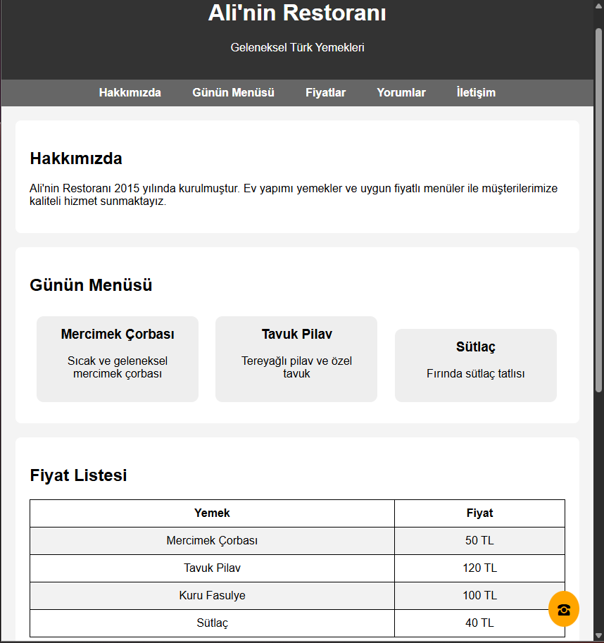
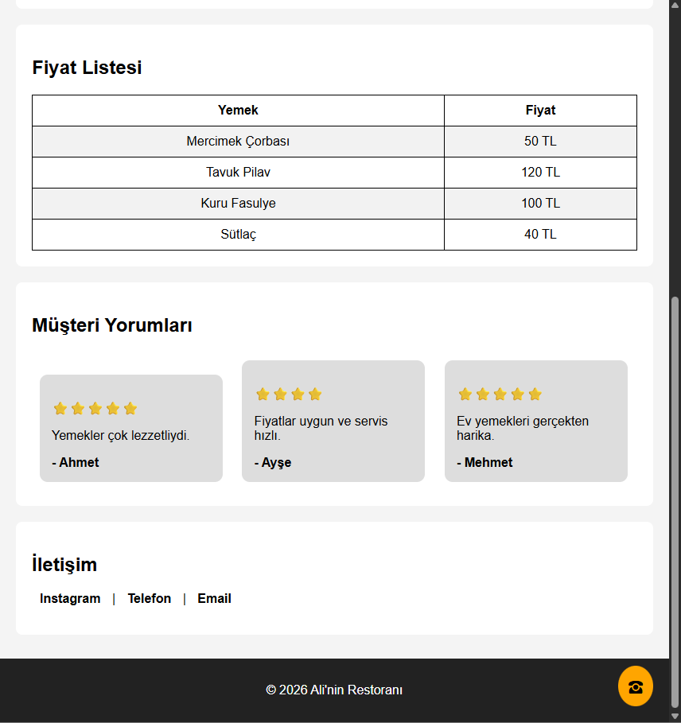

# 🍽️ CSS Ödevi — Restoran Tanıtım Sayfası

## Proje Amacı

Bu ödevin amacı, öğrendiğiniz **temel CSS konularını** bir proje üzerinde uygulamaktır.  
Proje tek sayfalık basit bir **restoran tanıtım sitesi** olacaktır.

### Kullanılacak CSS Konuları

| #  | Konu                         |
|----|------------------------------|
| 1  | `margin`                     |
| 2  | `padding`                    |
| 3  | `display`                    |
| 4  | `background` / `background-color` |
| 5  | `list-style`                 |
| 6  | `link` ve `hover` kullanımı  |
| 7  | `table` stil verme           |
| 8  | `position: fixed`            |

---

## Sayfa Yapısı (Genel Bakış)

Sayfa aşağıdaki **9 bölümden** oluşacaktır:

```
┌──────────────────────────────────┐
│  1. Header                       │
├──────────────────────────────────┤
│  2. Navigation Menü              │
├──────────────────────────────────┤
│  3. Hakkımızda                   │
├──────────────────────────────────┤
│  4. Günün Menüsü (Yemek Kartları)│
├──────────────────────────────────┤
│  5. Fiyat Listesi (Tablo)        │
├──────────────────────────────────┤
│  6. Müşteri Yorumları            │
├──────────────────────────────────┤
│  7. İletişim                     │
├──────────────────────────────────┤
│  8. Footer                       │
└──────────────────────────────────┘
        📞  9. Sabit Telefon İkonu (sağ alt köşe)
```

---

## Görevler

---

### Görev 1 — Header Bölümü

Sayfanın en üstünde bir başlık bölümü oluşturun.

**İçerik:**
- Restoran adı (örn. **Ali'nin Restoranı**)
- Kısa bir slogan (örn. *Geleneksel Türk Yemekleri*)

**Beklenen Görünüm:**

```
╔══════════════════════════════════╗
║       Ali'nin Restoranı          ║
║    Geleneksel Türk Yemekleri     ║
╚══════════════════════════════════╝
```


---

### Görev 2 — Navigation Menü

Header'ın altında bir **yatay navigasyon menüsü** oluşturun.

**Menü Linkleri:**
- Hakkımızda
- Günün Menüsü
- Fiyatlar
- Yorumlar
- İletişim

**Kurallar:**
- `<ul>` / `<li>` liste yapısı kullanılacak
- `display: inline-block` ile yatay hizalama yapılacak
- Hover'da link rengi değişecek


---

### Görev 3 — Hakkımızda Bölümü

Restoran hakkında kısa bir açıklama bölümü oluşturun.

**İçerik:**
- Bir başlık (`<h2>`)
- Bir açıklama paragrafı (`<p>`)

**Amaç:** Paragrafın bir **kutu görünümünde** olması.


---

### Görev 4 — Günün Menüsü (Yemek Kartları)

Bu bölümde **3 farklı yemek** kartı gösterilecektir.

**Örnek yemekler:**

| Kart | Yemek Adı       | Açıklama                  |
|------|-----------------|---------------------------|
| 1    | Mercimek Çorbası | Geleneksel lezzet          |
| 2    | Tavuk Pilav      | Tereyağlı pilav üstü tavuk |
| 3    | Sütlaç           | Fırında klasik sütlaç      |

**Beklenen Görünüm** — Kartlar yan yana:

```
┌──────────────┐  ┌──────────────┐  ┌──────────────┐
│ Mercimek     │  │ Tavuk Pilav  │  │ Sütlaç       │
│ Çorbası      │  │              │  │              │
│ Geleneksel   │  │ Tereyağlı    │  │ Fırında      │
│ lezzet       │  │ pilav üstü   │  │ klasik       │
│              │  │ tavuk        │  │ sütlaç       │
└──────────────┘  └──────────────┘  └──────────────┘
```
`

---

### Görev 5 — Fiyat Listesi (Tablo)

Bir `<table>` ile fiyat listesi oluşturun.

**Tablo Yapısı:**

| Yemek            | Fiyat  |
|------------------|--------|
| Mercimek Çorbası | 50 ₺   |
| Tavuk Pilav      | 90 ₺   |
| Sütlaç           | 45 ₺   |
| Adana Kebap      | 120 ₺  |
| Ayran             | 15 ₺   |

**Ek Görev:** Tablonun **çift satırları farklı renkte** olmalıdır.


---

### Görev 6 — Müşteri Yorumları

**3 farklı müşteri yorumu** kutu içinde ve **yan yana** gösterilecektir.

**Her kutuda:**
- ⭐ Yıldız değerlendirmesi
- Kısa yorum
- Müşteri adı

**Beklenen Görünüm:**

```
┌──────────────┐  ┌──────────────┐  ┌──────────────┐
│ ⭐⭐⭐⭐⭐     │  │ ⭐⭐⭐⭐       │  │ ⭐⭐⭐⭐⭐     │
│ "Harika      │  │ "Güzel       │  │ "Kesinlikle  │
│  lezzetler!" │  │  mekan."     │  │  tavsiye     │
│              │  │              │  │  ederim!"    │
│ — Ahmet      │  │ — Ayşe       │  │ — Mehmet     │
└──────────────┘  └──────────────┘  └──────────────┘
```


---

### Görev 7 — İletişim Bölümü

Aşağıdaki iletişim bağlantılarını oluşturun:

- 📷 Instagram
- 📞 Telefon
- 📧 Email

**Hover davranışı:** Mouse üzerine geldiğinde renk değişmelidir.


---

### Görev 8 — Footer

Sayfanın en altında bir footer oluşturun.

**İçerik:**

```
© 2026 Ali'nin Restoranı
```


---

### Görev 9 — Sabit Telefon İkonu

Sayfanın **sağ alt köşesinde** sabit duran bir telefon ikonu ekleyin.  
Sayfa kaydırılsa bile ikon **yerinde kalmalıdır**.


## Ornek Goruntu

--

